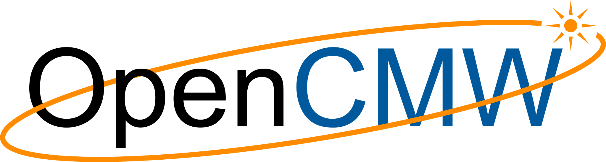

<picture>
<source srcset="assets/OpenCMW_logo_w.svg" media="(prefers-color-scheme: dark)">
<!--suppress HtmlDeprecatedAttribute -->

</picture>

[](https://gitter.im/fair-acc/opencmw?utm_source=badge&utm_medium=badge&utm_campaign=pr-badge)
[](https://opensource.org/licenses/LGPL-3.0)


[](https://lgtm.com/projects/g/fair-acc/opencmw-cpp/context:cpp)
[](https://www.codacy.com/gh/fair-acc/opencmw-cpp/dashboard?utm_source=github.com&amp;utm_medium=referral&amp;utm_content=fair-acc/opencmw-cpp&amp;utm_campaign=Badge_Grade)
[](https://www.codacy.com/gh/fair-acc/opencmw-cpp/dashboard?utm_source=github.com&utm_medium=referral&utm_content=fair-acc/opencmw-cpp&utm_campaign=Badge_Coverage)
[](https://codecov.io/gh/fair-acc/opencmw-cpp)
[](https://scan.coverity.com/projects/fair-acc-opencmw-cpp)
# Open Common Middle-Ware
... is a modular event-driven [micro-](https://en.wikipedia.org/wiki/Microservices) and [middle-ware](https://en.wikipedia.org/wiki/Middleware#:~:text=Middleware%20is%20a%20computer%20software,described%20as%20%22software%20glue%22.)
library for equipment- and beam-based monitoring as well as feedback control systems for the [FAIR](https://fair-center.eu/) Accelerator Facility ([video](https://www.youtube.com/watch?v=gCHzDR7hdoM))
or any other project that may find this useful.

In a nut-shell: it provides common communication protocols, interfaces to numerical data [visualisation](https://github.com/GSI-CS-CO/chart-fx)
and processing tools that shall aid accelerator engineers and physicist to write functional high-level monitoring and
(semi-)automated feedback applications that interact, simplify and improve our accelerator operation or its individual sub-systems.
Most notably, the focus is put on minimising the amount of boiler-plate code, programming expertise, and to significantly
lower the entry-threshold that is required to perform simple to advanced monitoring or 'measure-and-correct' applications
where the frame-work takes care of most of the communication, [data-serialisation](docs/IoSerialiser.md), data-aggregation
and buffering, settings management, Role-Based-Access-Control (RBAC), and other boring but necessary control system integrations
while still being open to expert-level modifications, extensions or improvements.

### General Schematic
OpenCMW combines [ZeroMQ](https://zeromq.org/)'s [Majordomo](https://rfc.zeromq.org/spec/7/) with LMAX's [disruptor](https://lmax-exchange.github.io/disruptor/) 
([C++ port](https://github.com/Abc-Arbitrage/Disruptor-cpp)) design pattern that both provide a very efficient lock-free mechanisms 
for distributing, streaming and processing of data objects. A schematic outline of the internal [architecture](https://edms.cern.ch/document/2444348/1) 
([local copy](assets/F-CS-SIS-en-B_0006_FAIR_Service_Middle_Ware_V1_0.pdf)) is shown below:


### Glossary

*Majordomo Broker* or *'Broker':* is the central authority where multiple workers can register their services, allowing clients to perform get, set or subscriptions requests.
There can be multiple brokers for subset of services.

*Worker:* functional unit which provides one or more services that are registered with a broker. OpenCMW provides base implementations at different abstraction levels ([BasicMdpWorker](BasicMdpWorker.cpp) (low-level) and
[MajordomoWorker](MajordomoWorker.cpp)) as well as different internal and external service workers, e.g. MajordomoRestPlugin or the broker's mmi services. Workers communicate with the broker using the OpenCMW worker [protocol](docs/MajordomoProtocol.md) internally or externally via ZeroMQ sockets via `inproc`, `tcp`, `udp` or another suitable low-level network protocol scheme that is supported by ZeroMQ.

*Endpoint:* address for a service following the standardised [URI](https://tools.ietf.org/html/rfc3986) convention of `scheme:[//authority]path[?query][#fragment]`. Services usually omit the authority part and provide only relative paths as this information is managed and added by their broker.
Each broker acts individually as a DNS for its own services as well as can forward this information to another (for the time being) central DNS Broker.

*internal/mmi workers:* each broker by default starts some lightweight management services as specified by the Majodomo [mmi](https://rfc.zeromq.org/spec/8/) extension:
- `<optional broker name>/mmi.service`: endpoints of all services registered at this broker
- `<optional broker name>/mmi.openapi`: openapi descriptions for the services
- `<optional broker name>/mmi.dns`: service lookup

*Context:* information that (if applicable) is matched to the URI's query parameter and required for every request and reply, specified by a domain object.
They (partially) map to the filters used in the EventStore and the query parameters of the communication library. The context is used for (partial/wildcard) matching and can be used in the EventStore's filter config.

*EventStore:* based on LMAX's [disruptor](https://lmax-exchange.github.io/disruptor/) ([C++ port](https://github.com/Abc-Arbitrage/Disruptor-cpp)) pattern, 
the EventStore provides datastructures and setup methods to define processing pipelines based on incoming data.

*EventHandler:* used to define specific internal processing steps based on EventStore events. The last EventHandler is usually also a Majordomo worker to export the processed information via the network.

*Publisher:* the [ClientContext](DataSourceExample.cpp) provides an interface to populate the EventStore
ring-buffer with events from OpenCMW, REST services or other sources.
While using disruptor ring-buffers is the preferred and most performing options, the client also supports classic patterns of registering call-back functions or returning `Future<reyly objects>` objects.

### Compile-Time-Reflection
The serialisers are based on a [compile-time-reflection](docs/CompileTimeSerialiser.md) that efficiently transform domain-objects to and from the given wire-format (binary, JSON, ...).
Compile-time reflection will become part of [C++23](http://www.open-std.org/jtc1/sc22/wg21/docs/papers/2019/p0592r4.html) as described by [David Sankel et al. , “C++ Extensions for Reflection”, ISO/IEC CD TS 23619, N4856](http://www.open-std.org/jtc1/sc22/wg21/docs/papers/2020/n4856.pdf). 
Until then, the compile-time reflection is emulated by the [refl-cpp](https://github.com/veselink1/refl-cpp) (header-only) library through a `constexpr` visitor-pattern and -- for the use in opencmw -- 
simplified/feature-reduced `ENABLE_REFLECTION_FOR(...)` macro:

```cpp
struct className {
    int         field1;
    // ...
    float       field2;
    std::string field3;
};
ENABLE_REFLECTION_FOR(className, field1, field2, field3) 
```
Beside common primitive and STL container types, it is possible to extend and to provide custom serialisation schemes for any other arbitrary type or struct/class constructs. Further, the interface
provides also an optional light-weight `constexpr` annotation template wrapper `Annotated<type, unit, description> ...` that can be used to provide some extra meta-information (e.g. unit, descriptions, etc.)
that in turn can be used to (re-)generate and document the class definition (e.g. for other programming languages or projects that do not have the primary domain-object definition at hand) 
or to generate a generic [OpenAPI](https://swagger.io/specification/) definition. More details can be found [here](docs/CompileTimeSerialiser.md).

### Building from source

Note that building from source is only required if you want to modify opencmw-cpp itself.

If you only want to make use of opencmw-cpp in your project to implement a service, it is not required to clone/build opencmw-cpp.
In that case, rather take a look at the project [opencmw-cpp-example](https://github.com/alexxcons/opencmw-cpp-example), which demonstrates how a simple, first service can be implemented.

For concrete build instructions, please check the [build instructions page](docs/BuildInstructions.md).

### Example

For an example on how to implement a simple, first service using opencmw-cpp, please take a look at the project [opencmw-cpp-example](https://github.com/alexxcons/opencmw-cpp-example).

The following provides some flavour of how a simple service can be implemented using OpenCMW with only a few lines of
custom user-code ([full sample](https://github.com/fair-acc/opencmw-java/tree/createReadme/server-rest/src/test/java/io/opencmw/server/rest/samples/BasicSample.java)):

```Java
// TODO: Java Concept to be ported/implemented in C++
@MetaInfo(description = "My first 'Hello World!' Service")
public static class HelloWorldWorker extends MajordomoWorker<BasicRequestCtx, NoData, ReplyData> {
    public HelloWorldWorker(final ZContext ctx, final String serviceName, final RbacRole<?>... rbacRoles) {
        super(ctx, serviceName, BasicRequestCtx.class, NoData.class, ReplyData.class, rbacRoles);

        // the custom used code:
        this.setHandler((rawCtx, requestContext, requestData, replyContext, replyData) -> {
            final String name = Objects.requireNonNullElse(requestContext.name, "");
            LOGGER.atInfo().addArgument(rawCtx.req.command).addArgument(rawCtx.req.topic)
                    .log("{} request for worker - requested topic '{}'");
            replyData.returnValue = name.isBlank() ? "Hello World" : "Hello, " + name + "!";
            replyContext.name = name.isBlank() ? "At" : (name + ", at") + " your service!";
        });

        // simple asynchronous notify example - (real-world use-cases would use another updater than Timer)
        new Timer(true).scheduleAtFixedRate(new TimerTask() {
            private final BasicRequestCtx notifyContext = new BasicRequestCtx(); // re-use to avoid gc
            private final ReplyData notifyData = new ReplyData(); // re-use to avoid gc
            private int i;
            @Override
            public void run() {
                notifyContext.name = "update context #" + i;
                notifyData.returnValue = "arbitrary data - update iteration #" + i++;
                try {
                    HelloWorldWorker.this.notify(notifyContext, notifyData);
                } catch (Exception e) {
                    LOGGER.atError().setCause(e).log("could not notify update");
                    // further handle exception if necessary
                }
            }
        }, TimeUnit.SECONDS.toMillis(1), TimeUnit.SECONDS.toMillis(2));
    }
}

@MetaInfo(description = "arbitrary request domain context object", direction = "IN")
public static class BasicRequestCtx {
    @MetaInfo(description = " optional 'name' OpenAPI documentation")
    public String name;
}

@MetaInfo(description = "arbitrary reply domain object", direction = "OUT")
public static class ReplyData {
    @MetaInfo(description = " optional 'returnValue' OpenAPI documentation", unit = "a string")
    public String returnValue;
}
```

These services can be accessed using OpenCMW's own [ClientContext](DataSourceExample.cpp)
client that queries or subscribes using one of the highly-optimised binary, JSON or other wire-formats and [ZeroMQ](https://zeromq.org/)-
or RESTful (HTTP)-based high-level protocols, or through a simple RESTful web-interface that also provides simple
'get', 'set' and 'subscribe' functionalities while developing, for testing, or debugging:


[comment]: <> (The basic HTML rendering is based on XXX template engine and can be customised. For more efficient, complex and cross-platform)
[comment]: <> (UI designs it is planned to allow embedding of WebAssembly-based &#40;[WASM]&#40;https://en.wikipedia.org/wiki/WebAssembly&#41;&#41; applications.)

### Performance
The end-to-end transmission achieving roughly 10k messages per second for synchronous communications and
about 140k messages per second for asynchronous and or publish-subscribe style data acquisition (TCP link via locahost).
The domain-object abstraction and serialiser taking typically only 5% of the overall performance w.r.t. bare-metal
transmissions (i.e. raw byte buffer transmission performance via ZeroMQ):
```
CPU:AMD Ryzen 9 5900X 12-Core Processor
description; n_exec; n_workers #0; #1; #2; #3; #4; avg
get,  sync, future,     domain-object ; 10000; 1;   7124.48;  10166.67;  10651.01;  10846.83;  10968.31;  10658.21
get,  sync, eventStore, domain-object ; 10000; 1;   9842.93;   9789.00;   9777.39;   9270.77;   9805.15;   9660.58
get,  sync, eventStore, raw-byte[]    ; 10000; 1;  12237.14;  12256.34;  12259.75;  13151.36;  13171.80;  12709.81
get, async, eventStore, domain-object ; 10000; 1;  46134.05;  50850.82;  48108.52;  54487.72;  46171.67;  49904.68
get, async, eventStore, raw-byte[]    ; 10000; 1;  48972.78;  53278.84;  52600.98;  54832.65;  53027.51;  53435.00
sub, async, eventStore, domain-object ; 10000; 1;  70222.57; 115074.45; 161601.24; 132852.50; 164151.85; 143420.01
sub, async, eventStore, raw-byte[]    ; 10000; 1; 121308.73; 123829.95; 124283.37; 166348.23; 128094.40; 135638.99
sub, async, callback,   domain-object ; 10000; 1; 111274.04; 118184.64; 123098.70; 116418.52; 107858.25; 116390.03
```
Your mileage may vary depending on the specific domain-object, processing logic, and choice of hardware (CPU/RAM),
but you can check and compare the results for your platform using the [RoundTripAndNotifyEvaluation](RoundTripAndNotifyEvaluation.cpp)
and/or [MdpImplementationBenchmark](MdpImplementationBenchmark.cpp) benchmarks.

### Documentation
.... more to follow.

### Don't like Cpp?
For prototyping applications or services that do not interact with hardware-based systems, a Java-based
[OpenCMW](https://github.com/fair-acc/opencmw-java) twin-project is being developed which follows the same functional style
but takes advantage of more concise implementation and C++-based type safety.

### Acknowledgements
The implementation heavily relies upon and re-uses time-tried and well-established concepts from [ZeroMQ](https://zeromq.org/)
(notably the [Majordomo](https://rfc.zeromq.org/spec/7/) communication pattern, see [Z-Guide](https://zguide.zeromq.org/docs/chapter4/#Service-Oriented-Reliable-Queuing-Majordomo-Pattern)
for details), LMAX's lock-free ring-buffer [disruptor](https://lmax-exchange.github.io/disruptor/) ([C++ port](https://github.com/Abc-Arbitrage/Disruptor-cpp)), [GNU-Radio](https://www.gnuradio.org/)
real-time signal processing framework, as well as previous implementations and
experiences gained at [GSI](https://www.gsi.de/), [FAIR](https://fair-center.eu/) and [CERN](https://home.cern/).

