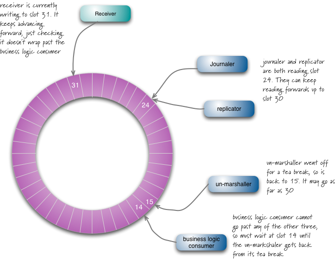

# Disruptor

## ... a High Performance Inter-Thread Messaging Library

This is a C++20 port of the [LMAX Disruptor](https://github.com/LMAX-Exchange/disruptor) initially developed by the LMAX Development Team [[1,2](##-References)], 
and is a modernised and optimised version based on earlier work by [ABC arbitrage](https://github.com/Abc-Arbitrage/Disruptor-cpp/).

## Brief Description

A Disruptor is a multicast graph of queues where producers put objects on it that are sent to all the consumers for parallel consumption through separate downstream queues. 
At its core, the Disruptor is based on a lock-free [Ringbuffer](include/disruptor/RingBuffer.hpp) that is thread-safe and optimised for multi-/single- producer/consumer processing scenarios.

Each producer and consumer has a sequence counter to indicate which slot in the buffer it's currently working on. 
Each producer/consumer writes its own sequence counter but can read the others' sequence counters. 
This way the producer can read the consumers' counters to ensure the slot it wants to write in is available without any locks on the counters. 
Similarly a consumer can ensure it only processes messages once another consumer is done with it by watching the counters.

A more conventional approach might use a producer queue and a consumer queue, each using locks as concurrency mechanisms. 
In practice, what happens with producer and consumer queues is that the queues are either completely empty or completely full most of the time, 
which causes lock contention and wasted clock cycles. The disruptor alleviates this, in part, by having all producers and consumers use the same queue mechanism, 
coordinating with each other by watching the sequence counters rather than using locking mechanisms 
([source](https://softwareengineering.stackexchange.com/questions/244826/can-someone-explain-in-simple-terms-what-is-the-disruptor-pattern#answer-244831)).

## References

  1. Martin Thompson, Dave Farley, Michael Barker, Patricia Gee, and Andrew Stewart, 
["Disruptor: High performance alternative to bounded queues for exchanging data between concurrent threads"](https://lmax-exchange.github.io/disruptor/disruptor.html), LMAX Group, 
May-2011, ([pdf](https://lmax-exchange.github.io/disruptor/files/Disruptor-1.0.pdf))
  2. Trishia Gee's blog at https://trishagee.com/ (N.B. some class names changed but the core concept remained the same):
     - [Dissecting the Disruptor: What’s so special about a ring buffer?](https://trishagee.com/2011/06/22/dissecting_the_disruptor_whats_so_special_about_a_ring_buffer/#more-442), June 22, 2011
     - [Dissecting the Disruptor: How do I read from the ring buffer?](https://trishagee.com/2011/06/28/dissecting_the_disruptor_how_do_i_read_from_the_ring_buffer/#more-192), June 28, 2011
     - [Dissecting the Disruptor: Writing to the ring buffer](https://trishagee.com/2011/07/04/dissecting_the_disruptor_writing_to_the_ring_buffer/), July  4, 2011
     - [Dissecting the Disruptor: Wiring up the dependencies](https://trishagee.com/2011/07/10/dissecting_the_disruptor_wiring_up_the_dependencies/), July 10, 2011
     - [Disruptor 2.0 – All Change Please](https://trishagee.com/2011/08/30/disruptor_20__all_change_please/), August 30, 2011
     - [Introduction to the Disruptor Slides](https://trishagee.com/2012/10/10/introduction_to_the_disruptor_slides/), October 10, 2012
  3. Martin Fowler's blog: [The LMAX [Disruptor] Architecture](https://martinfowler.com/articles/lmax.html), 12th July 2011 